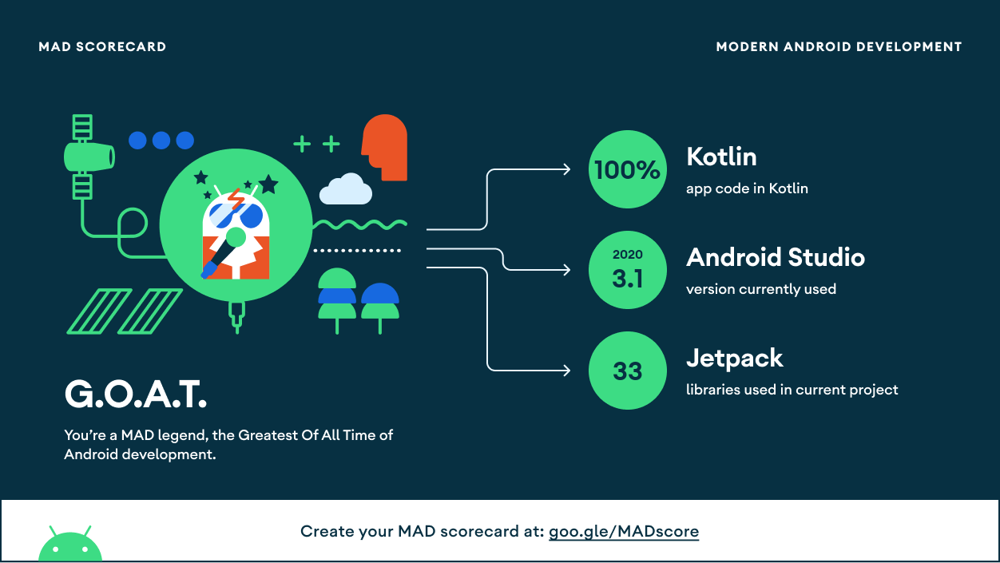
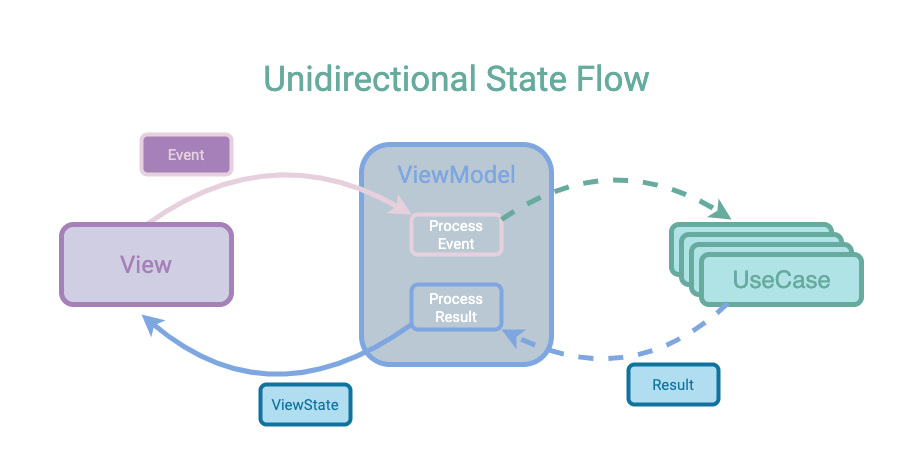

# Rick and Morty Beer Buddy

After a hard day of filming, the actors of the Rick and Morty series like to hang out at the nearest spaceport bar and relax, drinking beer and reminiscing about anecdotes.

But recently a strange virus has spread through the universe and the Ricks Council has imposed a series of restrictions that only allows social gatherings of two people.

Therefore, we have been asked to develop an app that the actors of the series can download to their phones and allow them to find the most like-minded beer buddy.

To obtain all the necessary data we will make use of the public API: [The Rick and Morty API](https://rickandmortyapi.com/).

## App requirements

First of all, the application must show a list with all the characters of the series, showing the following information for each one of them:

- Image of the character.
- Name of the character.
- Species and type.

Once the user selects a character the application will search for the perfect galactic beer companion by applying the following criteria:

- The Ricks Council has decreed perimeter confinement of planets, so actors will only be able to date actors that are in the same location.
- In order for them to have enough anecdotes to tell while getting drunk, priority will be given to the characters who have shared more times filming set, for this purpose the number of chapters in which they have coincided will be bought.
- In case two possible *matches* have shared the same number of chapters with the selected character, preference will be given to those who have known each other the longest, using the date of the first chapter in which they appeared together.
- If they have participated in the same number of chapters, and they met on the same day, priority will be given to the candidate who has not seen the selected character for the longest time, using the date of the last chapter in which they both appeared.
- Finally, in case there is more than one candidate that meets all the criteria, they will be ordered by ID.

Once the perfect *match* has been found, a screen with the following information will be displayed:

- Name of both characters.
- Image of both characters.
- Location of the date.
- Number of episodes in which they have appeared together.
- Date they met.
- Date they last saw each other.

## MAD Scoreboard

[Link to MAD Scoreboard](https://madscorecard.withgoogle.com/scorecards/1419406096/)

## Structure

The project is modularized by layers following [Clean Architecture](https://blog.cleancoder.com/uncle-bob/2012/08/13/the-clean-architecture.html) standards.

- **Domain** module:

    - Entities: The entity object contains the Critical Business Data.
    - Use Cases: Contain the rules that specify how and when the Critical Business Rules within the Entities are invoked. *"Use cases control the dance of the Entities"* - Robert C. Martin

- **Data** module:

    - Repositories: The repository is responsible to expose the data to the domain, resolving conflicts between multiple data sources and abstracting the data sources from the rest of the architecture.

    - Datasources: Each data source class should have the responsibility of working with only one source of data, which can be a file, a network source, or a local database.

- **App** module:

    - DI: Contains the dependency injection resolution.
    - UI: In the presentation layer, the unidirectional state flow pattern has been applied.
      

## Testing

- [JUnit](https://junit.org/junit4/)
- [Mockk](https://mockk.io/)
- [Kotest](https://kotest.io/)
- [Turbine](https://github.com/cashapp/turbine)